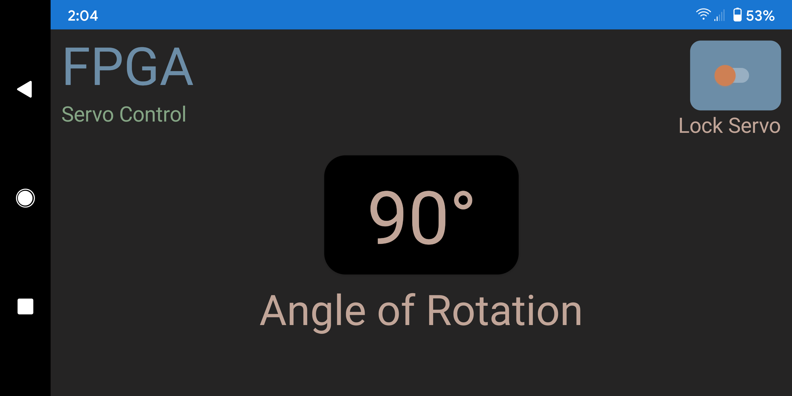

# Servo App

This is a custom Android app that connects to an FPGA through Bluetooth to control a servo motor.  The app uses the internal accelerometer of the phone to change the position of the servo.  The phone rotation is directly proportional to the servo rotation (e.g., if you rotate the phone 36 degrees, the servo will rotate 36 degrees, and so on).   Additionally, there is a toggle switch that will lock the servo in the desired position.

